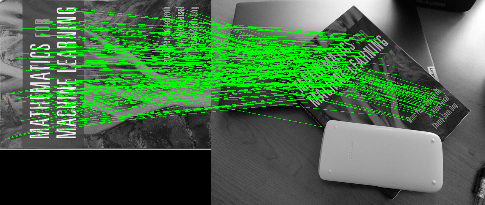
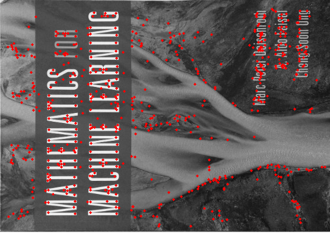

# SIFT in C++ with Python Binding

This repository contains a C++ implementation of the [SIFT (Scale-invariant Feature Transform) algorithm](https://en.wikipedia.org/wiki/Scale-invariant_feature_transform), along with Python bindings for easy integration into Python projects.

## Description

- Efficient C++ implementation of SIFT.
- Python binding for seamless usage in Python projects.
- Uses stb_image and stb_image_write libraries for loading and saving images (included in this repository).

## Getting Started

### Dependencies

Before you start, please make sure you have the following dependencies installed:

* **Python-3.8 or heigher**: This ropository has been tested on only `Python-3.8`. But theorectically it will work on higher versions of `Python-3.8`.

* **CMake 3.22.0 or higher**: If you don't have CMake installed, or if you need to update it, you can follow the instructions [here](https://askubuntu.com/questions/355565/how-do-i-install-the-latest-version-of-cmake-from-the-command-line). To use version 3.22, you can download it from https://cmake.org/files/v3.22/cmake-3.22.6.tar.gz.

* **[stb image library]((https://github.com/nothings/stb))**: C library for loading and saving images. It's included as a git submodule, so you don't need to do anything extra.

* **Pybind11**: It is included as a git submodule, so you don't need to do anything extra.

* **xtensor-assosiated library**: `xtensor` is a numpy for C++ library. All
  required `xtensor` code is added as git submodules. Unlike `Pybind11` library, I
  can't figure out a way to install `xtensor` by using `add_subdirectory` in 
  `CMakeLists.txt`. Thus, users must first install `xtl`, `xtensor`, and 
  `xsimd` under `/tmp` as following:
  * Isntall xtl:
  ```
  (cd extern/xtl && cmake -D CMAKE_INSTALL_PREFIX=/tmp/xtl-install && make install)
  ```
  * Install xtensor:
  ```
  (cd extern/xtensor && cmake -D CMAKE_INSTALL_PREFIX=/tmp/xtensor-install -DCMAKE_PREFIX_PATH=/tmp/xtl-install && make install)
  ```
  * Install xsimd:
  ```
  (cd extern/xsimd && cmake -D CMAKE_INSTALL_PREFIX=/tmp/xsimd-install && make install)
  ```
  You can choose to clone this repository and follow the commands above. If not, just make sure `xtl`, `xtensor`, and 
  `xsimd` are correctly installed under `/tmp`.

### Installing

It's a C++ project with Python binding. Thus, the installation process is primary aiming for Python users. Please follow the steps below to install this Python package `lion-sift-cpp`.

* (Optional) Download this repository.
  ```shell
  git clone --recursive https://github.com/lionlai1989/sift-cpp.git
  ```
  If you forgot to use the `--recursive` option when cloning, you can still clone the submodules by running the command `git submodule update --init --recursive`. Generally, you probably don't want to clone this repository. As a side note, you can also install this repository in editable mode.
  ```
  python3 -m pip install -e .
  ```

* Create a Python virtual environment `venv`, activate `venv`, and update pip:
  ```shell
  python3 -m venv venv && source venv/bin/activate && python3 -m pip install --upgrade pip
  ```

* Install from the repository: Notice the name of the package is `lion-sift-cpp`.
  ```
  python3 -m pip install "lion-sift-cpp @ git+https://github.com/lionlai1989/sift-cpp.git"
  ```

* (Optional) If the following error occurs:
  ```shell
  ~/venv/lib/python3.8/site-packages/pybind11/include/pybind11/detail/common.h:266:10: fatal error: Python.h: No such file or directory
  ```
  Please execute `sudo apt install python3-dev`. See [this](https://github.com/pybind/pybind11/issues/1728) for more information.

### Verifying Installation
- After following the instructions above, you can import `lion_sift_cpp` to see if it's correctly installed:
    ``` shell
    $ python
    Python 3.8.10 (default, May 26 2023, 14:05:08) 
    [GCC 9.4.0] on linux
    Type "help", "copyright", "credits" or "license" for more information.
    >>> import lion_sift_cpp
    >>>
    ```

- You can also download this image and run a testing script to visualize the result. 
  ```shell
  python3 run_sift.py image.png
  ```
  If everything goes well, you shall see the following image.
  Attach an image here.


## Developing

### Building
The building process includes the automatic testing procedure.

### Running
After building, you can run two example commands to check the development results.
* Finding Keypoints:

* Matching Keypoints:

### 

## Usage example
Find keypoints, match features in two images and save the result:
```cpp
#include <vector>
#include "image.hpp"
#include "sift.hpp"

int main()
{
    Image img("./../imgs/book_rotated.jpg");
    Image img2("./../imgs/book_in_scene.jpg");
    img = rgb_to_grayscale(img);
    img2 = rgb_to_grayscale(img2);
    std::vector<sift::Keypoint> kps1 = sift::find_keypoints_and_descriptors(img);
    std::vector<sift::Keypoint> kps2 = sift::find_keypoints_and_descriptors(img2);
    std::vector<std::pair<int, int>> matches = sift::find_keypoint_matches(kps1, kps2);
    Image book_matches = sift::draw_matches(img, img2, kps1, kps2, matches);
    book_matches.save("book_matches.jpg");
    return 0;
}
```

Result:


## Build and run the examples
### Build
```bash
cmake -G Ninja -S . -B build/ && cmake --build build/ -j 4 && (cd build/; ctest -V)
$ mkdir build/ && cd build && cmake .. && make
```
The executables will be in sift-cpp/bin/.

### Run
Find image keypoints, draw them and save the result:
```bash
$ cd bin/ && ./find_keypoints ../imgs/book_rotated.jpg
```
Input images can be .jpg or .png. Result image is saved as result.jpg



Find keypoints in two images and match them, draw matches and save the result:
```bash
$ cd bin/ && ./match_features ../imgs/book_rotated.jpg ../imgs/book_in_scene.jpg
```
Result image is saved as result.jpg

## Useful links

* [SIFT paper](https://www.cs.ubc.ca/~lowe/papers/ijcv04.pdf)
* [Anatomy of the SIFT method](http://www.ipol.im/pub/art/2014/82/article.pdf)
* [Blog post about a Python SIFT implementation](https://medium.com/@russmislam/implementing-sift-in-python-a-complete-guide-part-1-306a99b50aa5)
* [the original](https://github.com/dbarac/sift-cpp)


cmake -S . -B build -G Ninja && ninja -C build
./bin/find_keypoints imgs/book_rotated.jpg
python3 -m pip install git+ssh://git@github.com/lionlai1989/sift-cpp-pybind11


git submodule add https://gitlab.com/libeigen/eigen.git extern/eigen-3.4.0
check out tag 3.4.0 and commit inside the submodule
