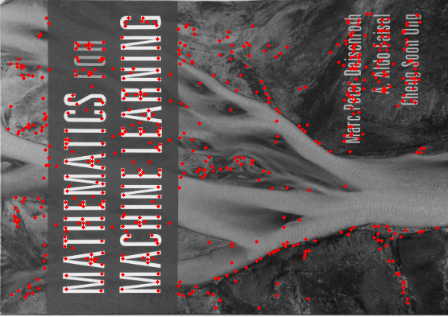

# SIFT in C++ with Python Binding

This repository contains a C++ implementation of the [SIFT (Scale-invariant Feature Transform) algorithm](https://en.wikipedia.org/wiki/Scale-invariant_feature_transform), along with Python bindings for easy integration into Python projects.

This repository is mainly derived from this [original sift-cpp repository](https://github.com/dbarac/sift-cpp). 

## Description

- Use `xtensor` to replace `eigen` perform array operation.
- Efficient C++ implementation of SIFT.
- Use `pybind11` for seamlessly integration into Python projects.
- Uses `stb_image` and `stb_image_write` libraries for loading and saving images.

## Getting Started

### Dependencies

Before you start, please make sure you have the following dependencies installed:

* **Python-3.8 or heigher**: This ropository has been tested on only `Python-3.8`. But theorectically it will work on higher versions of `Python-3.8`.

* **CMake 3.22.0 or higher**: If you don't have CMake installed, or if you need to update it, you can follow the instructions [here](https://askubuntu.com/questions/355565/how-do-i-install-the-latest-version-of-cmake-from-the-command-line). To use version 3.22, you can download it from https://cmake.org/files/v3.22/cmake-3.22.6.tar.gz.

* **[stb image library](https://github.com/nothings/stb)**: C library for loading and saving images. `stb` is included as a git submodule, so you don't need to do anything else to install it.

* **Pybind11**: It creates Python binding for Python projects. `Pybind11` is included as a git submodule, so you don't need to do anything else to install it.

* **xtensor-assosiated library**: `xtensor` is a numpy for C++ library. All
  required `xtensor` code is added as git submodules. Unlike `Pybind11` library, I
  can't figure out a way to install `xtensor` by using `add_subdirectory` in 
  `CMakeLists.txt`. Thus, users must first install `xtl`, `xtensor`, and 
  `xsimd` under `/tmp` as following:
  * Isntall xtl:
  ```
  (cd extern/xtl && cmake -D CMAKE_INSTALL_PREFIX=/tmp/xtl-install && make install)
  ```
  * Install xtensor:
  ```
  (cd extern/xtensor && cmake -D CMAKE_INSTALL_PREFIX=/tmp/xtensor-install -DCMAKE_PREFIX_PATH=/tmp/xtl-install && make install)
  ```
  * Install xsimd:
  ```
  (cd extern/xsimd && cmake -D CMAKE_INSTALL_PREFIX=/tmp/xsimd-install && make install)
  ```
  You can choose to clone this repository and follow the commands above. If not, just make sure `xtl`, `xtensor`, and 
  `xsimd` are correctly installed under `/tmp`.

### Installing

This is a C++ project with Python bindings. Therefore, the installation process primarily targets Python users. Please follow the steps below to install this Python package, `lion-sift-cpp`.

* (Optional) Download this repository.
  ```shell
  git clone --recursive https://github.com/lionlai1989/sift-cpp.git
  ```
  If you forgot to use the `--recursive` option when cloning, you can still clone the submodules by running the command `git submodule update --init --recursive`. Generally, you don't need to clone this repository to install this package. As a side note, you can also install this repository in editable mode.
  ```
  python3 -m pip install -e .
  ```

* Create a Python virtual environment `venv_sift`, activate `venv_sift`, and update pip:
  ```shell
  python3 -m venv venv_sift && source venv_sift/bin/activate && python3 -m pip install --upgrade pip
  ```

* Install from the repository: Notice the name of the package is `lion-sift-cpp`.
  ```
  python3 -m pip install "lion-sift-cpp @ git+https://github.com/lionlai1989/sift-cpp.git"
  ```

* (Optional) If the following error occurs:
  ```shell
  ~/venv/lib/python3.8/site-packages/pybind11/include/pybind11/detail/common.h:266:10: fatal error: Python.h: No such file or directory
  ```
  Please execute `sudo apt install python3-dev`. See [this](https://github.com/pybind/pybind11/issues/1728) for more information.

### Verifying Installation
- After following the instructions above, you can import `lion_sift_cpp` to see if it's correctly installed:
    ``` shell
    $ python
    Python 3.8.10 (default, May 26 2023, 14:05:08) 
    [GCC 9.4.0] on linux
    Type "help", "copyright", "credits" or "license" for more information.
    >>> import lion_sift_cpp
    >>>
    ```

- You can also download the image [`rectified_satellite_image.png`](https://github.com/lionlai1989/sift-cpp/blob/refactor-with-xtensor/imgs/rectified_satellite_image.png) and run a testing script
  [`find_keypoints.py`](https://github.com/lionlai1989/sift-cpp/blob/refactor-with-xtensor/examples/find_keypoints.py) to visualize the result.
  ```shell
  python3 examples/find_keypoints.py imgs/rectified_satellite_image.png
  python3 find_keypoints.py rectified_satellite_image.png
  ```
  If everything goes well, you shall see the following message:
  ```
  Input image's shape: (2045, 2488, 1).
  Convert shape to (1, 2045, 2488).
  Found 47510 keypoints.
  The first keypoint:
  kp.i: 435, kp.j: 123, kp.x: 217.3883486962404, kp.y: 61.563993150604524
  kp.descriptor is a 128-vector whose shape is (128,).
  ```


## Developing

### Building

The following command builds the project in the `build/` folder and runs the tests automatically.
```shell
cmake -G Ninja -S . -B build/ && cmake --build build/ -j 4 && (cd build/; ctest -V)
```
If everything goes well, it should show the message below.
```txt
100% tests passed, 0 tests failed out of 21

Total Test time (real) =  10.65 sec
```

### Running
After a successful building, two example commands, `find_keypoints` and `match_features`, are generated in `bin/`.
These two commands can verify the overall SIFT implementation is correct.

* Finding Keypoints:
    ```shell
    (cd bin/; ./find_keypoints ../imgs/book_rotated.jpg)
    ```
  The command above generates an image `find_keypoints_result.png` in the `bin/` as shown below:
    <figure>
    
    <figcaption style="font-size: small;"></figcaption>
    </figure>

* Matching Keypoints:
    ```shell
    (cd bin/; ./match_features ../imgs/book_rotated.jpg ../imgs/book_in_scene.jpg)
    ```
  The command above generates an image `match_features_result.jpg` in the `bin/` as shown below:
    <figure>
    
    <figcaption style="font-size: small;"></figcaption>
    </figure>

## Version History

* 2.0.0
    * `xtensor` needs to be installed first on the system and then `sift-cpp` can be installed. Use `xtensor` to perform array operation.
* 1.0.0
    * `sift-cpp` is installable via `pip`. No other dependencies need to be installed beforehand.

## Reference:

* [SIFT paper](https://www.cs.ubc.ca/~lowe/papers/ijcv04.pdf)
* [Anatomy of the SIFT method](http://www.ipol.im/pub/art/2014/82/article.pdf)
* [Blog post about a Python SIFT implementation](https://medium.com/@russmislam/implementing-sift-in-python-a-complete-guide-part-1-306a99b50aa5)


<!-- 
python3 -m pip install git+ssh://git@github.com/lionlai1989/sift-cpp-pybind11


git submodule add https://gitlab.com/libeigen/eigen.git extern/eigen-3.4.0
check out tag 3.4.0 and commit inside the submodule -->
